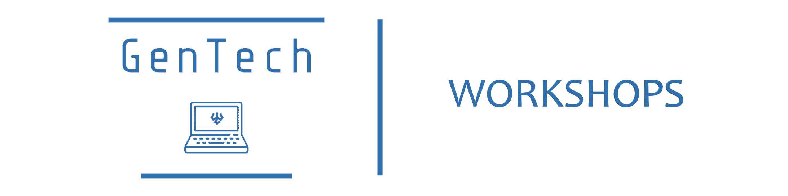

# GenTech: Workshop - 2

In this workshop, we introduced participants to Web Development in building their own personal portfolio sites using HTML and CSS. We used the BootStrap framework for components and styling.

# Files and Folders

The `Slide-deck.pdf` file is a short introduction to the languages we used. It contains example code and its output, as well as commonly used elements and syntax rules.

Inside the folder named `the-site`, you will find the fully built site along with the image assets used.

- `index.html` : consists of the HTML for our webpage.
- `style.css` : contains the custom styles we have added.
- `/images` : is the folder that contains the images used in our site.

# Resources Used

- [Google Fonts](https://fonts.google.com/)
- [IonIcons](https://ionicons.com/)
- [BootStrap](https://getbootstrap.com/docs/5.0)
- [Form Spree](https://formspree.io/)
- [Undraw](https://undraw.co/)
